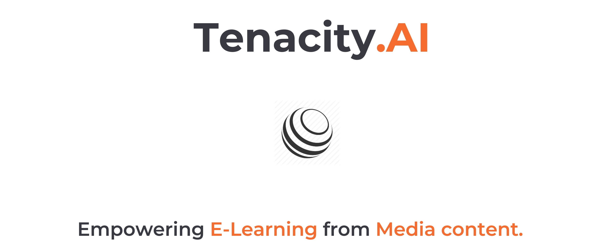

# Tenacity.AI

Requires Node.js , Bower, CloudFoundry CLI, IBM Cloud Account. 

### DESIGNED BY

>- Arpit Jain 
>- Gautam Yadav 

### TO USE
  
>- Run the following commands in the terminal, $ cd TenacityAI $ npm install $ bower install $ brew install ffmpeg --with-opus $ npm install node-ffprobe 

>- Edit the .env file with the necessary settings using the provided credentials of the services of IBM Cloud. 

>- Open 2 parallel windows of the terminal: In the first one run the node js application, $ npm start In the second one upload the videos either from the local server or online link, $ bin/processMedia -S -f public/media_files/grid-breakers.mp4 or $ bin/processMedia -S -f http://someurl.com/somefilename.mp4 

>- Open http://localhost:6007/ or http://multimediaanalyser.eu-gb.mybluemix.net/ and enter the following, username: gautam password: gautams  

### VIEW DEMO VIDEO 

